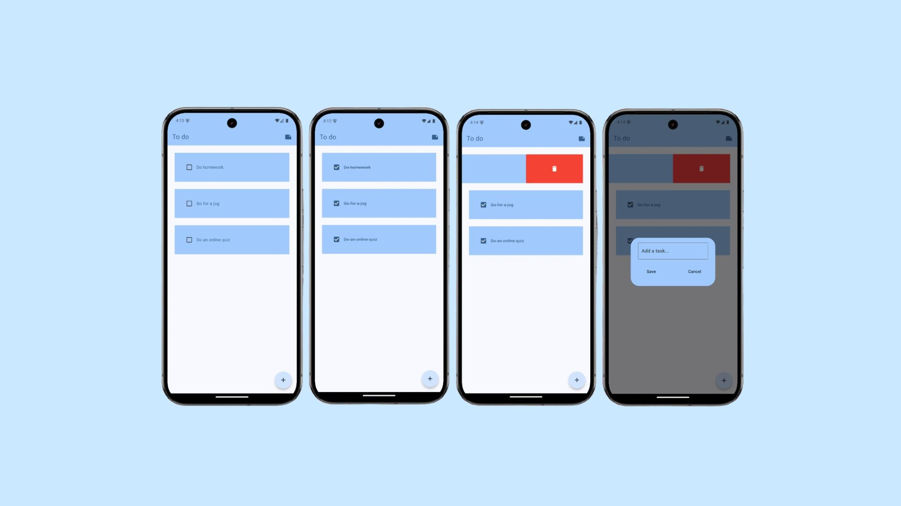

# Flutter To-Do App

## Overview

This Flutter to-do app allows users to create, mark, and delete tasks efficiently. Designed with simplicity and functionality in mind, it offers an intuitive interface for task management.

## Features

- Add new tasks.
- Mark tasks as completed or pending.
- Delete tasks with a swipe gesture.
- Interactive and visually appealing UI.

## Getting Started

### Prerequisites

Flutter installed on your system (installation guide).
An IDE (like Android Studio, IntelliJ, or VS Code) with Flutter/Dart plugins installed.

### Installation

Clone the repository:

  ```bash
  git clone <repository-link>
  ```

Navigate to the project directory:

  ```bash
  cd flutter-to-do-app
  ```

Install dependencies:

  ```bash
  flutter pub get
  ```

### Running the App

Connect a physical device or start an emulator.
Run the following command:

  ```bash
  flutter run
  ```

#### Packages Used

The following Dart packages are used in this project:

1. flutter_slidable: To implement swipe-to-delete functionality.
2. hive: For local data storage.
3. hive_flutter: For seamless Hive integration with Flutter.

#### Developer Dependencies

1. hive_generator: To generate Hive TypeAdapters for data serialization.
2. build_runner: For code generation, used alongside Hive.

#### Dependency List

To add these packages to your Flutter project, ensure your pubspec.yaml file includes:

#### Dependencies:

    dependencies:
      flutter:
        sdk: flutter
      flutter_slidable: ^3.1.1
      hive: ^2.2.3
      hive_flutter: ^1.1.0
      
#### Dev Dependencies:

    dev_dependencies:
      flutter_test:
        sdk: flutter
      flutter_lints: ^4.0.0
      hive_generator: ^2.0.1
      build_runner: ^2.4.13
      
## App Preview



## How to Use

1. Add a new task using the + button.
2. Mark tasks as complete by ticking the checkbox.
3. Delete tasks by swiping them left or right.

## Built With

- Flutter - Framework for building the app.
- Dart - Programming language for Flutter.

## Future Enhancements

- Task categorization (e.g., work, personal).
- Add notifications for task reminders.
- Enhance the UI with animations and themes.

## Contributing

Feel free to submit issues or pull requests for improvements and feature suggestions.
